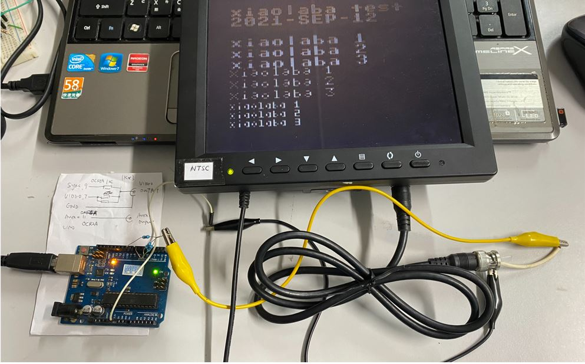

# Arduino_TVout  
no fork, but clone and modification for work with UNO or Atmega328p  

  

ref. source
https://www.arduino.cc/reference/en/libraries/tvout/  
https://github.com/Avamander/arduino-tvout  

issue, https://github.com/Avamander/arduino-tvout/issues/130

### burn hex directly
burn_UNO_NTSC.bat  
burn_UNO_PAL.bat  

### notice
library 1.0.1 and Arduino IDE 1.8.15 are not working together.  

opened the Library Manager in the Arduino IDE and install it from there  

perhaps author/Arduino.CC is able to help to fix this bug.  

workaround as described for ordinary user,  

goto C:\Users\YOUR_NAME\Documents\Arduino\libraries\TVout  
move folder TVoutfonts to C:\Users\YOUR_NAME\Documents\Arduino\libraries\  
